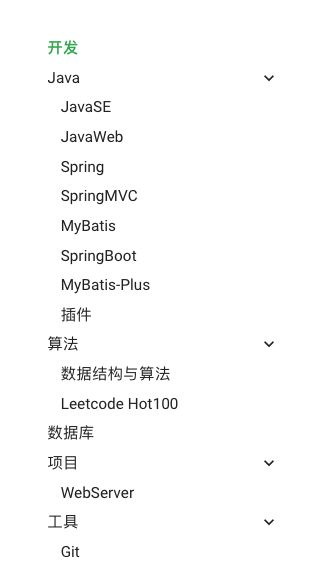
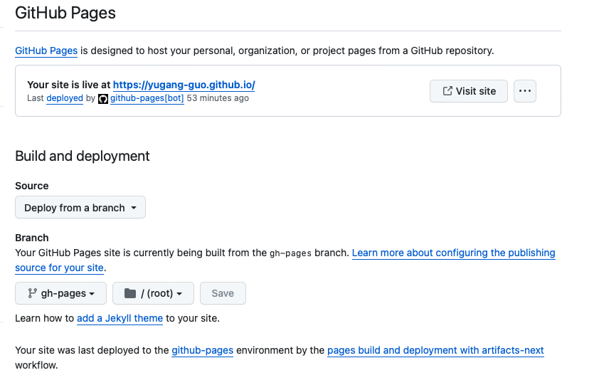

# 如何构建个人主页

## 简介

构建自己的 Github 个人主页，通过 mkdocs 将 markdown 文件自动转化为 html 文件，无需关注前端页面开发，只需专注于网页内容。

## mkdocs

通过 python 安装 mkdocs 包

```shell
pip install mkdocs
```

创建你的个人主页的文件夹（应与你的 github 账户名相同）

```shell
mkdocs new personPage
```

文件夹结构

- docs：内容相关的文件夹，如 index.md
- mkdocs.yml：mkdocs配置文件

本地启动，点击命令行中的链接，即可实时预览网页

```shell
// 进入项目文件夹
mkdocs serve
```

## Github

创建一个与 Github 账户名相同的仓库，并克隆到本地

打开项目文件夹

创建如下的文件结构

```
.
├── .github
│   └── workflows
│       └── PublishMySite.yml
├── docs
│   └── index.md
└── mkdocs.yml
```

其中 PublishMySite.yml 内容如下

```yml
name: publish site
on: # 在什么时候触发工作流
  push: # 在从本地main分支被push到GitHub仓库时
    branches:
      - main
  pull_request: # 在main分支合并别人提的pr时
    branches:
      - main
jobs: # 工作流的具体内容
  deploy:
    runs-on: ubuntu-latest # 创建一个新的云端虚拟机 使用最新Ubuntu系统
    steps:
      - uses: actions/checkout@v2 # 先checkout到main分支
      - uses: actions/setup-python@v2 # 再安装Python3和相关环境
        with:
          python-version: 3.x
      - run: pip install mkdocs-material # 使用pip包管理工具安装mkdocs-material
      - run: mkdocs gh-deploy --force # 使用mkdocs-material部署gh-pages分支
```

## 个性化配置

使用 Material for MkDocs 来更改网页风格

本人的 MkDocs 配置信息文件 mkdocs.yml 参考

```yml
# 网页信息部分
# [Info]
site_name: 郭玉刚的个人主页
site_url: https://yugang-guo.github.io
site_author: 郭玉刚
site_description: 郭玉刚的个人主页

# 网页上方标签栏、文档布局
# [Navigtion]
nav:
  - 博客:
    - Blog/index.md
  - 开发:
    - Dev/index.md
    - Java: 
      - JavaSE: Dev/JavaSE.md
      - JavaWeb: Dev/JavaWeb.md
      - Spring: Dev/Spring.md
      - SpringMVC: Dev/SpringMVC.md
      - MyBatis: Dev/MyBatis.md
      - SpringBoot: Dev/SpringBoot.md
      - MyBatis-Plus: Dev/MyBatis-Plus.md
      - 插件: Dev/plugin.md
    - 算法:
      - 数据结构与算法: Dev/DSA.md
      - Leetcode Hot100: Dev/Hot100.md
    - 数据库: Dev/MySQL.md
    - 项目:
      - WebServer: Dev/webserver.md
    - 工具:
      - Git: Dev/git.md
  - 外语:
    - Lang/index.md
  - 生活:
    - Life/index.md

# 网页UI配置
# [UI]
## [top]
theme:
  name: material
  # font:
  #   text: Roboto  # 常规字体
  #   code: Roboto Mono  #代码块字体
  palette:
    - scheme: default # 日间模式
      primary: green # 上方的
      accent: orange # 链接等可交互元件的高亮色
      toggle:
        icon: material/weather-night # 图标
        name: 切换至夜间模式 # 鼠标悬浮提示
    - scheme: slate # 夜间模式
      primary: indigo
      accent: orange
      toggle:
        icon: material/weather-sunny
        name: 切换至日间模式
  features:
    - navigation.tabs # 使用Tab来进行分类
    - navigation.top # 返回顶部的按钮 在上滑时出现
    - navigation.indexes # Tab会有一个index.md 而不是在打开Tab时打开第一篇文章
    - navigation.expand # 打开Tab时左侧目录全部展开
    - search.suggest # 搜索输入一些字母时推荐补全整个单词
    - search.highlight # 搜索出的文章关键词加入高亮
    - content.code.copy # 可以通过按钮复制代码
    - content.action.edit # 点击按钮跳转到编辑页面  需要结合 edit_uri 一起使用
    # - toc.integrate # 右侧生产目录
  language: zh # 一些提示性的文字会变成中文
  icon:
    repo: fontawesome/brands/github
edit_uri: edit/main/docs # 编辑按钮跳转的链接
## [top-right corner]
repo_url: https://github.com/yugang-guo/yugang-guo.github.io # 右上角点击跳转的链接
repo_name: yugang-guo.github.io # 右上角的名字
## [bottom-left corner]
copyright: 郭玉刚 CC-BY-4.0 # 左下角的版权声明
## [bottom-right corner]
extra:
  social: # icons
    - icon: fontawesome/brands/bilibili
      link: https://space.bilibili.com/384189219
      name: bilibili | Terry-gyg # 鼠标悬浮提示
    - icon: fontawesome/brands/github
      link: https://github.com/yugang-guo
      name: GitHub | Terry

# [Extensions]
plugins:
  - search: # 现在还不支持中文搜索 支持之后可以设置语言
    # insider已经支持中文的分词搜索了 https://squidfunk.github.io/mkdocs-material/blog/2022/chinese-search-support/
      lang:
        - en
        - ja
  - tags # 给单篇文章添加标签 https://squidfunk.github.io/mkdocs-material/setup/setting-up-tags/?h=tags
markdown_extensions:
  - pymdownx.arithmatex: # 数学公式支持
      generic: true
  - attr_list # 给图片后面添加{width="300"}设置大小
  - toc:
      permalink: true # 固定标题位置为当前位置
  - pymdownx.highlight: # 代码块高亮
      # linenums: true # 显示行号
      # auto_title: true # 显示编程语言名称
  - pymdownx.superfences # 代码块高亮插件
  - meta # 支持Markdown文件上方自定义标题标签等
  - admonition # https://squidfunk.github.io/mkdocs-material/reference/admonitions/#inline-blocks
  - pymdownx.details # admonition需要

extra_javascript:
  # 数学公式支持
  # https://squidfunk.github.io/mkdocs-material/reference/math/#katex
  - mkdocs/javascripts/katex.js
  - https://cdnjs.cloudflare.com/ajax/libs/KaTeX/0.16.7/katex.min.js  
  - https://cdnjs.cloudflare.com/ajax/libs/KaTeX/0.16.7/contrib/auto-render.min.js
extra_css:
  - https://cdnjs.cloudflare.com/ajax/libs/KaTeX/0.16.7/katex.min.css
  - mkdocs/css/no-footer.css # 不使用底部的翻页
  - mkdocs/css/unordered-list-symbols.css # multiplt unordered list symbols
```

配置效果图如下：




## 上传

git 上传你的个人主页项目

Github 进入个人主页仓库，配置属性

- 进入 Settings > Actions > General
- Actions permissions 选择 Allow all actions and reusable workflows
- Workflow permissions 选择 Read and write permissions
- 点击保存

-------------------------------------------------

- 进入 Settings > Pages
- 更改为如下的配置
- 点击保存



等待 Github 运行成功后， 即可访问你的个人主页：

Github账户名.github.io

以后增加修改内容，只需添加和修改 markdown 文件，然后提交到 Github，无需再进行配置，网页会自动进行更新
