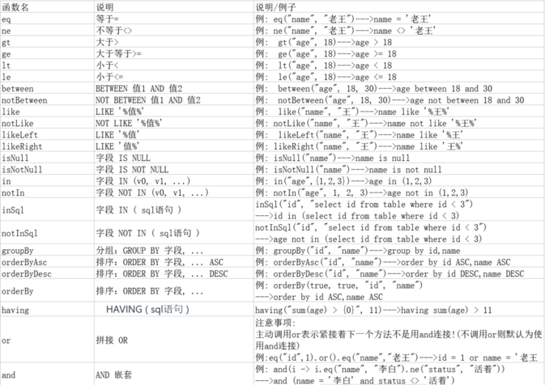

# MyBatis-Plus 笔记

Mapper 接口继承 MyBatis-Plus 提供的 BaseMapper 基础接口，自动提供 CRUD 方法

```java
// 泛型为数据库对应的实体类
public interface UserMapper extends BaseMapper<User> {}
```

## Mapper 接口

### Insert

```java
// 插入一条记录
// T 就是要插入的实体对象
// 默认主键生成策略为雪花算法（后面讲解）
int insert(T entity);
```

|类型|参数名|描述|
|-|-|-|
|T|entity|实体对象|

### Delete

```java
// 根据 entity 条件，删除记录
int delete(@Param(Constants.WRAPPER) Wrapper<T> wrapper);

// 删除（根据ID 批量删除）
int deleteBatchIds(@Param(Constants.COLLECTION) Collection<? extends Serializable> idList);

// 根据 ID 删除
int deleteById(Serializable id);

// 根据 columnMap 条件，删除记录
int deleteByMap(@Param(Constants.COLUMN_MAP) Map<String, Object> columnMap);
```

|类型|参数名|描述|
|-|-|-|
|Wrapper<T>|wrapper|实体对象封装操作类（可以为 null）|
|Collection<? extends Serializable>|idList|主键 ID 列表(不能为 null 以及 empty)|
|Serializable|id|主键 ID|
|Map<String, Object>|columnMap|表字段 map 对象|

### Update

```java
// 根据 whereWrapper 条件，更新记录
int update(@Param(Constants.ENTITY) T updateEntity, 
            @Param(Constants.WRAPPER) Wrapper<T> whereWrapper);

// 根据 ID 修改  主键属性必须值
int updateById(@Param(Constants.ENTITY) T entity);
```

|类型|参数名|描述|
|-|-|-|
|T|entity|实体对象 (set 条件值,可为 null)|
|Wrapper<T>|updateWrapper|实体对象封装操作类（可以为 null,里面的 entity 用于生成 where 语句）|

### Select

```java
// 根据 ID 查询
T selectById(Serializable id);

// 根据 entity 条件，查询一条记录
T selectOne(@Param(Constants.WRAPPER) Wrapper<T> queryWrapper);

// 查询（根据ID 批量查询）
List<T> selectBatchIds(@Param(Constants.COLLECTION) Collection<? extends Serializable> idList);

// 根据 entity 条件，查询全部记录
List<T> selectList(@Param(Constants.WRAPPER) Wrapper<T> queryWrapper);

// 查询（根据 columnMap 条件）
List<T> selectByMap(@Param(Constants.COLUMN_MAP) Map<String, Object> columnMap);

// 根据 Wrapper 条件，查询全部记录
List<Map<String, Object>> selectMaps(@Param(Constants.WRAPPER) Wrapper<T> queryWrapper);

// 根据 Wrapper 条件，查询全部记录。注意： 只返回第一个字段的值
List<Object> selectObjs(@Param(Constants.WRAPPER) Wrapper<T> queryWrapper);

// 根据 entity 条件，查询全部记录（并翻页）
IPage<T> selectPage(IPage<T> page, @Param(Constants.WRAPPER) Wrapper<T> queryWrapper);

// 根据 Wrapper 条件，查询全部记录（并翻页）
IPage<Map<String, Object>> selectMapsPage(IPage<T> page, @Param(Constants.WRAPPER) Wrapper<T> queryWrapper);

// 根据 Wrapper 条件，查询总记录数
Integer selectCount(@Param(Constants.WRAPPER) Wrapper<T> queryWrapper);
```

|类型|参数名|描述|
|-|-|-|
|Serializable|id|主键 ID|
|Wrapper<T>|queryWrapper|实体对象封装操作类（可以为 null）|
|Collection<? extends Serializable>|idList|主键 ID 列表(不能为 null 以及 empty)|
|Map<String, Object>|columnMap|表字段 map 对象|
|IPage<T>|page|分页查询条件（可以为 RowBounds.DEFAULT）|

## Service 接口

Service 接口封装 IService 接口，CRUD 采用 `get 查询单行` `remove 删除` `list 查询集合` `page 分页` 前缀命名方式

```java
// Service 接口
public interface UserService extends IService<User> {}

// Service 实现类
// 需指定Mapper接口、实现类
@Service
public class UserServiceImpl extends ServiceImpl<UserMapper,User> implements UserService {}
```

### CRUD 方法

```java
保存：
// 插入一条记录（选择字段，策略插入）
boolean save(T entity);
// 插入（批量）
boolean saveBatch(Collection<T> entityList);
// 插入（批量）
boolean saveBatch(Collection<T> entityList, int batchSize);

修改或者保存：
// TableId 注解存在更新记录，否插入一条记录
boolean saveOrUpdate(T entity);
// 根据updateWrapper尝试更新，否继续执行saveOrUpdate(T)方法
boolean saveOrUpdate(T entity, Wrapper<T> updateWrapper);
// 批量修改插入
boolean saveOrUpdateBatch(Collection<T> entityList);
// 批量修改插入
boolean saveOrUpdateBatch(Collection<T> entityList, int batchSize);

移除：
// 根据 queryWrapper 设置的条件，删除记录
boolean remove(Wrapper<T> queryWrapper);
// 根据 ID 删除
boolean removeById(Serializable id);
// 根据 columnMap 条件，删除记录
boolean removeByMap(Map<String, Object> columnMap);
// 删除（根据ID 批量删除）
boolean removeByIds(Collection<? extends Serializable> idList);

更新：
// 根据 UpdateWrapper 条件，更新记录 需要设置sqlset
boolean update(Wrapper<T> updateWrapper);
// 根据 whereWrapper 条件，更新记录
boolean update(T updateEntity, Wrapper<T> whereWrapper);
// 根据 ID 选择修改
boolean updateById(T entity);
// 根据ID 批量更新
boolean updateBatchById(Collection<T> entityList);
// 根据ID 批量更新
boolean updateBatchById(Collection<T> entityList, int batchSize);

数量： 
// 查询总记录数
int count();
// 根据 Wrapper 条件，查询总记录数
int count(Wrapper<T> queryWrapper);

查询：
// 根据 ID 查询
T getById(Serializable id);
// 根据 Wrapper，查询一条记录。结果集，如果是多个会抛出异常，随机取一条加上限制条件 wrapper.last("LIMIT 1")
T getOne(Wrapper<T> queryWrapper);
// 根据 Wrapper，查询一条记录
T getOne(Wrapper<T> queryWrapper, boolean throwEx);
// 根据 Wrapper，查询一条记录
Map<String, Object> getMap(Wrapper<T> queryWrapper);
// 根据 Wrapper，查询一条记录
<V> V getObj(Wrapper<T> queryWrapper, Function<? super Object, V> mapper);

集合：
// 查询所有
List<T> list();
// 查询列表
List<T> list(Wrapper<T> queryWrapper);
// 查询（根据ID 批量查询）
Collection<T> listByIds(Collection<? extends Serializable> idList);
// 查询（根据 columnMap 条件）
Collection<T> listByMap(Map<String, Object> columnMap);
// 查询所有列表
List<Map<String, Object>> listMaps();
// 查询列表
List<Map<String, Object>> listMaps(Wrapper<T> queryWrapper);
// 查询全部记录
List<Object> listObjs();
// 查询全部记录
<V> List<V> listObjs(Function<? super Object, V> mapper);
// 根据 Wrapper 条件，查询全部记录
List<Object> listObjs(Wrapper<T> queryWrapper);
// 根据 Wrapper 条件，查询全部记录
<V> List<V> listObjs(Wrapper<T> queryWrapper, Function<? super Object, V> mapper);

```

### 分页查询

- 添加分页拦截器

```java
@Bean
public MybatisPlusInterceptor mybatisPlusInterceptor() {
    MybatisPlusInterceptor interceptor = new MybatisPlusInterceptor();
    interceptor.addInnerInterceptor(new PaginationInnerInterceptor(DbType.MYSQL));
    return interceptor;
}
```

- Service 方法：调用 Mapper 方法

```java
//1.条件构造器
LambdaQueryWrapper<Headline> queryWrapper = new LambdaQueryWrapper<>();
queryWrapper.like(!StringUtils.isEmpty(portalVo.getKeyWords()),Headline::getTitle,portalVo.getKeyWords())
        .eq(portalVo.getType()!= null,Headline::getType,portalVo.getType());

//2.分页参数（当前页数，总页数）
IPage<Headline> page = new Page<>(portalVo.getPageNum(),portalVo.getPageSize());

//3.Mapper方法（page，实体类）
headlineMapper.selectPageMap(page, portalVo);

//4.结果封装
//分页数据封装
Map<String,Object> pageInfo =new HashMap<>();
pageInfo.put("分页数据",page.getRecords()); // List<实体类>
pageInfo.put("当前页",page.getCurrent());
pageInfo.put("每页显示的记录数",page.getSize());
pageInfo.put("总页数",page.getPages());
pageInfo.put("总记录数",page.getTotal());
pageInfo.put("是否有上一页",page.hasPrevious());
pageInfo.put("是否有下一页",page.getTotal());

Map<String,Object> pageInfoMap=new HashMap<>();
pageInfoMap.put("pageInfo",pageInfo);
// 响应JSON
return Result.ok(pageInfoMap);
```

- Mapper 方法

```java
//传入参数携带Ipage接口
//返回结果为IPage
IPage<User> selectPageVo(IPage<?> page, Integer id);
```

### 条件构造器

Wrapper ： 条件构造抽象类，最顶端父类

- AbstractWrapper ： 用于查询条件封装，生成 sql 的 where 条件
    - QueryWrapper ： 查询/删除条件封装
    - UpdateWrapper ： 修改条件封装
    - AbstractLambdaWrapper ： 使用Lambda 语法
        - LambdaQueryWrapper ：用于Lambda语法使用的查询Wrapper
        - LambdaUpdateWrapper ： Lambda 更新封装Wrapper


- UpdateWrapper可以将列值修改为 null 值，可随意更改列值

**条件语法：**



### 核心注解

- `@TableName`
    - 描述：表名注解，标识实体类对应的表
    - 使用位置：实体类
- `@Table`
    - 描述：主键注解
    - 使用位置：实体类主键字段
- `@TableField`
    - 描述：字段注解（非主键）

```java
// 实体类
@TableName("sys_user")
public class User {
    @TableId(value="主键列名",type=主键策略)
    private Long id;
    @TableField("nickname")
    private String name;
    private Integer age;
    private String email;
}
```

|属性|类型|必须指定|默认值|描述|
|-|-|-|-|-|
|value|String|否|""|主键字段名|
|type|Enum|否|IdType.NONE|指定主键类型|


IdType 可选参数：

|值|描述|
|-|-|
|AUTO|数据库 ID 自增 (mysql配置主键自增长)|
|ASSIGN_ID（默认）|分配 ID(主键类型为 Number(Long )或 String)(since 3.3.0),使用接口`IdentifierGenerator`的方法`nextId`(默认实现类为`DefaultIdentifierGenerator`雪花算法)|

## 逻辑删除

逻辑删除：通过更改记录的状态或添加标记字段来模拟删除操作

**逻辑删除字段**

- 数据库

```sql
ALTER TABLE USER ADD deleted INT DEFAULT 0 ;  # int 类型 1 逻辑删除 0 未逻辑删除 
```

- 实体类：`@TableLogic`注解

```java
@Data
public class User {

   // @TableId
    private Integer id;
    private String name;
    private Integer age;
    private String email;
    
    @TableLogic
    //逻辑删除字段 int mybatis-plus下,默认 逻辑删除值为1 未逻辑删除 1 
    private Integer deleted;
}

```