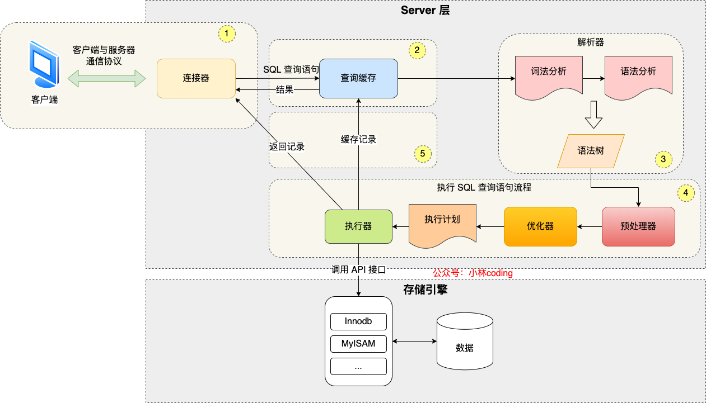
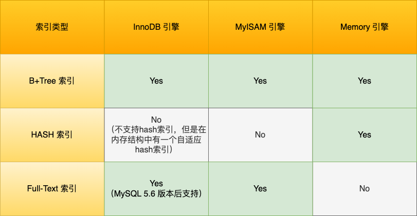
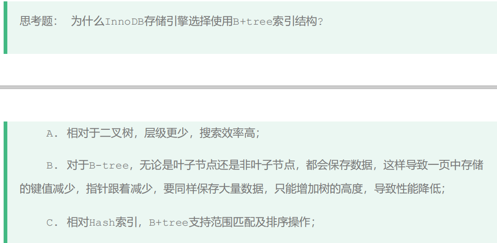
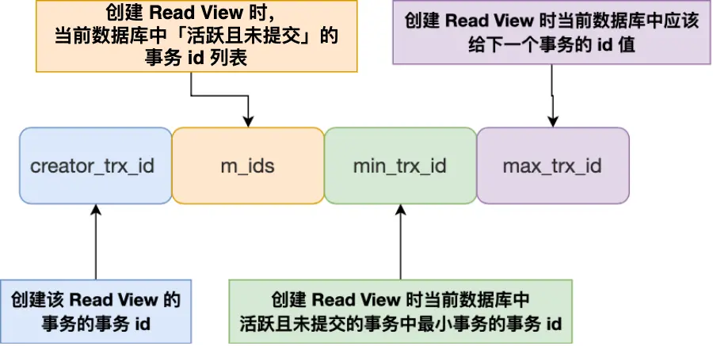
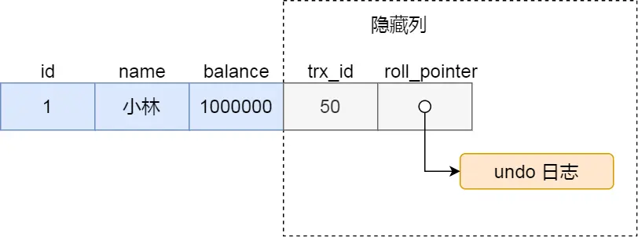
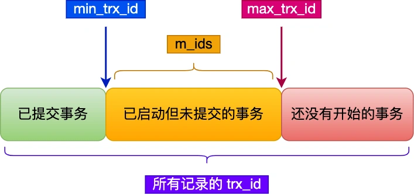
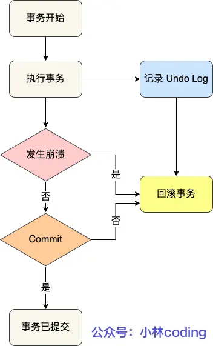
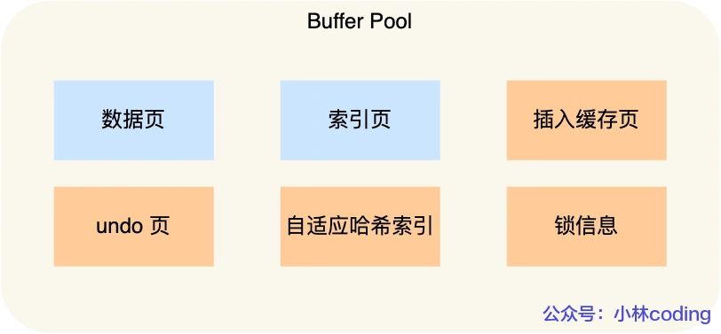
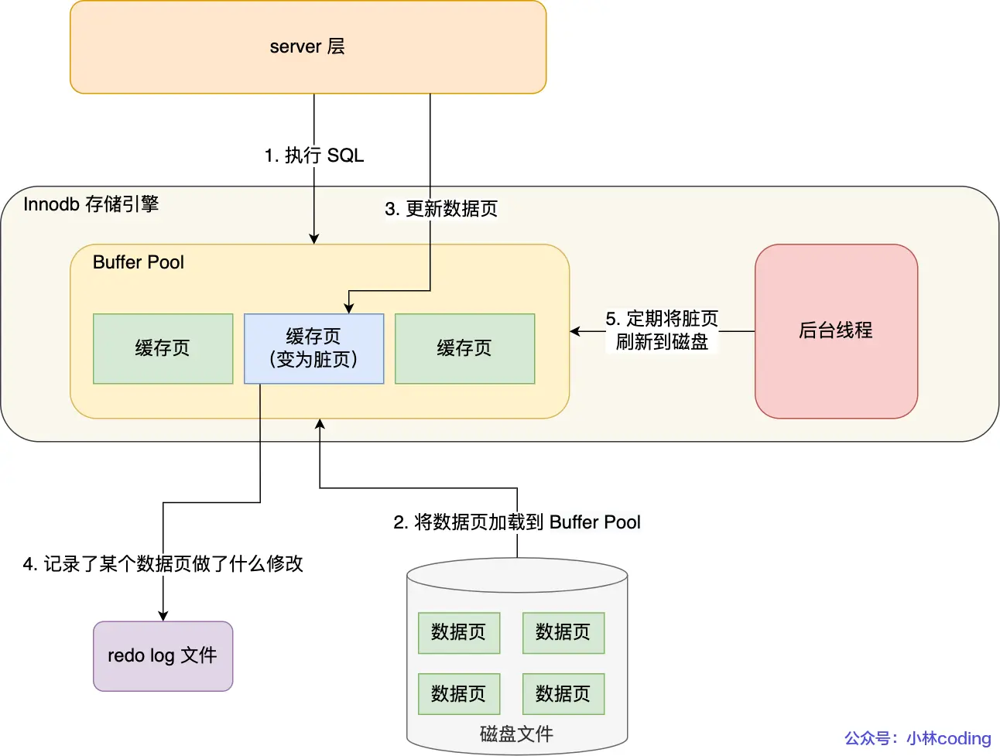
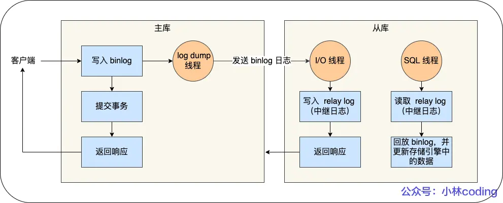

# MySQL 笔记

## 一条SQL语句的执行流程

MySQL 的架构共分为两层：Server 层和存储引擎层，

- Server 层负责建立连接、分析和执行 SQL。MySQL 大多数的核心功能模块都在这实现，主要包括连接器，查询缓存、解析器、预处理器、优化器、执行器等。
- 存储引擎层负责数据的存储和提取。支持 InnoDB、MyISAM、Memory 等多个存储引擎，不同的存储引擎共用一个 Server 层。

**流程**

- 连接器：建立连接，管理连接、校验用户身份；
- 查询缓存：查询语句如果命中查询缓存则直接返回，否则继续往下执行。MySQL 8.0 已删除该模块；
- 解析 SQL，通过解析器对 SQL 查询语句进行词法分析、语法分析，然后构建语法树，方便后续模块读取表名、字段、语句类型；
- 执行 SQL：执行 SQL 共有三个阶段：
  - 预处理阶段：检查表或字段是否存在；将 `select *` 中的 `*` 符号扩展为表上的所有列。
  - 优化阶段：基于查询成本的考虑， 选择查询成本最小的执行计划；
  - 执行阶段：根据执行计划执行 SQL 查询语句，从存储引擎读取记录，返回给客户端；

## 索引

### 定义

索引：帮助存储引擎快速获取数据的一种数据结构，形象的说就是索引是数据的目录。

MySQL的索引是在存储引擎层实现的

### 是否需要索引

需要创建索引：

- 字段有唯一性限制的
- 经常用于 `WHERE` 查询条件的字段，这样能够提高整个表的查询速度，如果查询条件不是一个字段，可以建立联合索引。
- 经常用于 `GROUP BY` 和 `ORDER BY` 的字段，这样在查询的时候就不需要再去做一次排序了，因为我们都已经知道了建立索引之后在 B+Tree 中的记录都是排序好的。

不需要创建索引：

- `WHERE` 条件，`GROUP BY`，`ORDER BY` 里用不到的字段
- 字段中存在大量重复数据
- 表数据太少的时候，不需要创建索引；
- 经常更新的字段不用创建索引

### 分类

#### 数据结构

从数据结构的角度来看，MySQL 常见索引有 B+Tree 索引、Hash 索引、Full-Text 索引（全文索引）

在创建表时，InnoDB 存储引擎会根据不同的场景选择不同的列作为索引：

- 如果有主键，默认会使用主键作为聚簇索引的索引键（key）；
- 如果没有主键，就选择第一个不包含 NULL 值的唯一列作为聚簇索引的索引键（key）；
- 在上面两个都没有的情况下，InnoDB 将自动生成一个隐式自增 id 列作为聚簇索引的索引键（key）；

#### 物理存储

从物理存储的角度来看，索引分为聚簇索引（主键索引）、二级索引（辅助索引）

- 主键索引的 B+Tree 的叶子节点存放的是实际数据，所有完整的用户记录都存放在主键索引的 B+Tree 的叶子节点里；
- 二级索引的 B+Tree 的叶子节点存放的是主键值，而不是实际数据。

**覆盖索引**：在查询时使用了二级索引，如果查询的数据能在二级索引里查询的到，那么就不需要回表，这个过程就是覆盖索引。

**回表**：如果查询的数据不在二级索引里，依据二级索引得到的主键值，再检索主键索引，就能查询到数据了，这个过程就是回表。

#### 字段特性

- 主键索引：建立在主键字段上的索引，通常在创建表的时候一起创建，一张表最多只有一个主键索引，索引列的值不允许有空值。
- 唯一索引：建立在 UNIQUE 字段上的索引，一张表可以有多个唯一索引，索引列的值必须唯一，但是允许有空值。
- 普通索引：建立在普通字段上的索引，既不要求字段为主键，也不要求字段为 UNIQUE。
- 前缀索引：指对字符类型字段的前几个字符建立的索引，而不是在整个字段上建立的索引。目的是减少索引占用的存储空间，提升查询效率。

#### 字段个数

- 单列索引：建立在单列上的索引称为单列索引，比如主键索引
- 联合索引（复合索引）：建立在多列上的索引称为联合索引

**联合索引的注意事项**：

1. 最左匹配原则
2. 遇到 >、< 的范围查询会停止匹配：范围查询的字段可以用到联合索引，但是在范围查询字段的后面的字段无法用到联合索引
3. 对于 >=、<=、BETWEEN、like 前缀匹配的范围查询，并不会停止匹配
4. 索引下推：对于范围查询停止匹配的情况：
   1. 在 MySQL 5.6 之前，只能从 ID（主键值）开始一个个回表，到「主键索引」上找出数据行，再对比后面的字段是否符合。
   2. MySQL 5.6 引入的索引下推优化（index condition pushdown)， 可以在联合索引遍历过程中，对联合索引中包含的字段先做判断，直接过滤掉不满足条件的记录，减少回表次数。

### 索引优化

1. 前缀索引优化

   使用某个字段中字符串的前几个字符建立索引

   优点：减小索引字段大小，可以增加一个索引页中存储的索引值，有效提高索引的查询速度。

   局限性：

   - order by 无法使用前缀索引

   - 无法把前缀索引用作覆盖索引

2. 覆盖索引优化（避免回表）

3. 主键索引最好是自增的

   - 自增主键：每次插入的新数据就会按顺序添加到当前索引节点的位置，不需要移动已有的数据，插入数据效率高。
   - 非自增主键：每次插入主键的索引值都是随机的，因此每次插入新的数据时，就可能会插入到现有数据页中间的某个位置，这将不得不移动其它数据来满足新数据的插入，甚至需要从一个页面复制数据到另外一个页面，我们通常将这种情况称为页分裂。页分裂还有可能会造成大量的内存碎片，导致索引结构不紧凑，从而影响查询效率。
   - 主键字段的长度不要太大：主键字段长度越小，意味着二级索引的叶子节点越小（二级索引的叶子节点存放的数据是主键值），这样二级索引占用的空间也就越小。

4. 索引最好设置为 NOT NULL

	- 索引列存在 NULL 就会导致优化器在做索引选择的时候更加复杂，更加难以优化
	- NULL 值是一个没意义的值，但是它会占用物理空间（行格式中至少会用 1 字节空间存储 NULL 值列表）

5. 防止索引失效

   - 使用左或者左右模糊匹配（`like %xx` 、 `like %xx%`）会造成索引失效

   - 在查询条件中对索引列做了计算、函数、隐式类型转换（字符串和数字比较的时候，会自动把字符串转为数字）操作，会造成索引失效

   - 联合索引需要遵循最左匹配原则以及范围查询时的注意情况，否则就会导致索引失效

   - 在 WHERE 子句中，如果在 OR 前的条件列是索引列，而在 OR 后的条件列不是索引列，那么索引会失效。

### count 性能比较

count(`*`) = count(1) > count(主键字段) > count(字段)

## 数据页

- InnoDB 的数据是按「数据页」为单位来读写的，默认数据页大小为 16 KB。
- 在数据页的文件头（File Header）中有两个指针，分别指向上一个数据页和下一个数据页，使得数据页之间通过双向链表的形式组织起来，物理上不连续，但是逻辑上连续。
- 数据页内包含用户记录，每个记录之间用单向链表的方式组织起来（插入、删除的效率高），为了加快在数据页内高效查询记录，设计了一个页目录，页目录存储每组最后一条记录的地址偏移量（槽），使得可以通过二分查找法的方式进行检索从而提高效率。
- 在 B+ 树中，叶子节点和非叶子节点的数据结构是一样的，区别在于，叶子节点存放的是实际的行数据，而非叶子节点存放的是主键和页号

## 为什么InnoDB选择B+ tree索引结构？

**二叉树**

​	缺点：1、顺序插入时，会形成一个链表，查询性能大大降低。2、大数据量情况下，层级较深，检索速度慢。 

红黑树是一颗自平衡二叉树，可以避免缺点1，但仍存在缺点2。 

**B-tree**

B树叶子节点和非叶子节点都会存放数据，B+树只有叶子节点存放数据，非叶子节点只起到索引数据的作用。

B树的每个节点是由页或磁盘块存放数据的，每页的大小是固定的（16K），导致B树中一个页存放的key和指针数量小于B+树，相同数据量的情况下，层级更深。

**Hash索引**

Hash索引只支持对等比较，不支持范围查询。无法进行排序操作。

## 事务

### 事务的四大特性（ACID）

- 原子性（Atomicity）：事务是不可分割的最小操作单元，要么全部成功，要么全部失败。
- 一致性（Consistency）：事务完成时，必须使所有的数据都保持一致状态。
- 隔离性（Isolation）：数据库系统提供的隔离机制，保证事务在不受外部并发操作影响的独立环境下运行。 
- 持久性（Durability）：事务一旦提交或回滚，对数据的改变就是永久的，即便系统故障也不会丢失。 

**InnoDB 引擎如何来保证事务的这四个特性?**
- 原子性是通过 undo log（回滚日志） 来保证的；
- 持久性是通过 redo log （重做日志）来保证的；
- 隔离性是通过 MVCC（多版本并发控制） 或锁机制来保证的；
- 一致性则是通过持久性+原子性+隔离性来保证；

### 并发事务会导致什么问题？

1. 赃读：一个事务读到另外一个事务还没有提交的数据。
2. 不可重复读：一个事务先后读取同一条记录，但两次读取的数据不同，称之为不可重复读。 
3. 幻读：在一个事务内多次查询某个符合查询条件的记录数量，出现前后两次查询到的记录数量不一样的现象。 

### 事务隔离级别

为了解决并发事务所引发的问题，在数据库中引入了事务隔离级别:
- 读未提交（read uncommitted）：指一个事务还没提交时，它做的变更就能被其他事务看到；
- 读提交（read committed）：指一个事务提交之后，它做的变更才能被其他事务看到；
- 可重复读（repeatable read）：指一个事务执行过程中看到的数据，一直跟这个事务启动时看到的数据是一致的，MySQL InnoDB 引擎的默认隔离级别；
- 串行化（serializable ）：会对记录加上读写锁，在多个事务对这条记录进行读写操作时，如果发生了读写冲突的时候，后访问的事务必须等前一个事务执行完成，才能继续执行，即只允许一个事务正在操作。

**如何实现四种事务隔离级别：**
- 对于「读未提交」隔离级别的事务来说，因为可以读到未提交事务修改的数据，所以直接读取最新的数据就好了
- 对于「串行化」隔离级别的事务来说，通过加读写锁的方式来避免并行访问
- 对于「读提交」和「可重复读」隔离级别的事务来说，它们是通过 Read View（快照） 来实现的
  - 「读提交」隔离级别是在「每个语句执行前」都会重新生成一个 Read View
  - 「可重复读」隔离级别是「启动事务时」生成一个 Read View，然后整个事务期间都在用这个 Read View

### 可重复读 如何避免幻读

MySQL 在「可重复读」隔离级别下，可以很大程度上避免幻读现象的发生（注意是很大程度避免，并不是彻底避免）

- 针对快照读（普通 select 语句），是通过 MVCC 方式解决了幻读，因为可重复读隔离级别下，事务执行过程中看到的数据，一直跟这个事务启动时看到的数据是一致的，即使中途有其他事务插入了一条数据，是查询不出来这条数据的，所以就很好了避免幻读问题。
- 针对当前读（select ... for update 等语句），是通过 next-key lock（临键锁=记录锁+间隙锁）方式解决了幻读，因为当执行 select ... for update 语句的时候，会加上 next-key lock，如果有其他事务在 next-key lock 锁范围内插入了一条记录，那么这个插入语句就会被阻塞，无法成功插入，所以就很好了避免幻读问题。

**但在特殊场景下仍有可能发生幻读，若要避免幻读的发生，尽量在开启事务之后，马上执行 select ... for update 这类当前读的语句，因为它会对记录加 next-key lock，从而避免其他事务插入一条新记录。**

### MVCC(多版本并发控制)

Read View 有四个重要的字段：
- m_ids ：指的是在创建 Read View 时，当前数据库中「活跃事务」的事务 id 列表，注意是一个列表，“活跃事务”指的就是，启动了但还没提交的事务。
- min_trx_id ：指的是在创建 Read View 时，当前数据库中「活跃事务」中事务 id 最小的事务，也就是 m_ids 的最小值。
- max_trx_id ：这个并不是 m_ids 的最大值，而是创建 Read View 时当前数据库中应该给下一个事务的 id 值，也就是全局事务中最大的事务 id 值 + 1；
- creator_trx_id ：指的是创建该 Read View 的事务的事务 id。

对于使用 InnoDB 存储引擎的数据库表，它的聚簇索引记录中都包含下面两个隐藏列：

- trx_id，当一个事务对某条聚簇索引记录进行改动时，就会把该事务的事务 id 记录在 trx_id 隐藏列里；
- roll_pointer，每次对某条聚簇索引记录进行改动时，都会把旧版本的记录写入到 undo 日志中，然后这个隐藏列是个指针，指向每一个旧版本记录，于是就可以通过它找到修改前的记录。

在创建 Read View 后，我们可以将记录中的 trx_id 划分这三种情况：

- 若trx_id < min_trx_id ，表示这个版本的记录是在创建 Read View 前已经提交的事务生成的，所以该版本的记录对当前事务可见。
-  若trx_id >= max_trx_id 值，表示这个版本的记录是在创建 Read View 后才启动的事务生成的，所以该版本的记录对当前事务不可见。
-  若min_trx_id <= trx_id < max_trx_id ，需要判断 trx_id 是否在 m_ids 列表中：
   -  trx_id 在 m_ids 列表中，表示生成该版本记录的活跃事务依然活跃着（还没提交事务），所以该版本的记录对当前事务不可见。
   -  trx_id 不在 m_ids列表中，表示生成该版本记录的活跃事务已经被提交，所以该版本的记录对当前事务可见。

若该版本记录对当前事务不可见，当前事务不会读取该版本的记录，而是沿着 undo log 链条往下找旧版本的记录，直到找到 trx_id < 当前事务的 min_trx_id 值的第一条记录。

这种通过「版本链」来控制并发事务访问同一个记录时的行为就叫 MVCC（多版本并发控制）。

## 锁

### 全局锁

全局锁执行后，整个数据库就处于只读状态了，主要应用于做全库逻辑备份

**如何避免备份数据库数据时使用全局锁对业务的影响：**

如果数据库的引擎支持可重复读的隔离级别，那么在备份数据库之前先开启事务，会先创建 Read View，然后整个事务执行期间都在用这个 Read View，而且由于 MVCC 的支持，备份期间业务依然可以对数据进行更新操作。因为在可重复读的隔离级别下，即使其他事务更新了表的数据，也不会影响备份数据库时的 Read View，这就是事务四大特性中的隔离性，这样备份期间备份的数据一直是在开启事务时的数据。

### 表级锁

**表锁**

- 共享锁（读锁）：本客户端可读，不可写；其他客户端可读，不可写
- 独占锁（写锁）：本客户端可读，可写；其他客户端不可读，不可写

**元数据锁（MDL）**

不需要显示的使用 元数据锁（MDL），因为当我们对数据库表进行操作时，会自动给这个表加上 元数据锁（MDL）

- 对一张表进行 CRUD （增删改查）操作时，加的是 MDL 读锁；
- 对一张表做结构变更操作的时候，加的是 MDL 写锁；

为了保证当用户对表执行 CRUD 操作时，防止其他线程对这个表结构做了变更。

MDL 是在事务提交后才会释放，这意味着事务执行期间，MDL 是一直持有的。

**意向锁**

- 在使用 InnoDB 引擎的表里对某些记录加上「共享锁」之前，需要先在表级别加上一个「意向共享锁」；
- 在使用 InnoDB 引擎的表里对某些纪录加上「独占锁」之前，需要先在表级别加上一个「意向独占锁」；

意向共享锁和意向独占锁是表级锁，不会和行级的共享锁和独占锁发生冲突，而且意向锁之间也不会发生冲突，只会和 共享表锁 和 独占表锁 发生冲突。

表锁和行锁是满足读读共享、读写互斥、写写互斥的

意向锁的目的：为了快速判断表里是否有记录被加锁

**AUTO-INC 锁**

目的：使表里的主键通常设置成自增的

AUTO-INC 锁是特殊的表锁机制，锁不是再一个事务提交后才释放，而是再执行完插入语句后就会立即释放。

### 行级锁

InnoDB 引擎是支持行级锁的，而 MyISAM 引擎并不支持行级锁。

普通的 select 语句是不会对记录加锁的，因为它属于快照读。

共享锁（S锁）满足读读共享，读写互斥。独占锁（X锁）满足写写互斥、读写互斥。

- Record Lock：记录锁，锁住的是一条记录，记录锁是有 S 锁和 X 锁之分的
- Gap Lock ：间隙锁，只存在于可重复读隔离级别，目的是为了解决可重复读隔离级别下幻读的现象。
  间隙锁虽然存在 X 型间隙锁和 S 型间隙锁，但是并没有什么区别，间隙锁之间是兼容的，即两个事务可以同时持有包含共同间隙范围的间隙锁，并不存在互斥关系，因为间隙锁的目的是防止插入幻影记录而提出的。
- Next-Key Lock：临键锁，是 Record Lock + Gap Lock 的组合，锁定一个范围，并且锁定记录本身。
  虽然相同范围的间隙锁是多个事务相互兼容的，但对于记录锁，我们是要考虑 X 型与 S 型关系，X 型的记录锁与 X 型的记录锁是冲突的。
- 插入意向锁：一个事务在插入一条记录的时候，需要判断插入位置是否已被其他事务加了间隙锁（next-key lock 也包含间隙锁）。如果有的话，插入操作就会发生阻塞，直到拥有间隙锁的那个事务提交为止（释放间隙锁的时刻），在此期间会生成一个插入意向锁，表明有事务想在某个区间插入新记录，但是现在处于等待状态。
  插入意向锁名字虽然有意向锁，但是它并不是意向锁，它是一种特殊的间隙锁，属于行级别锁。
  如果说间隙锁锁住的是一个区间，那么「插入意向锁」锁住的就是一个点。
  插入意向锁与间隙锁的另一个非常重要的差别是：尽管「插入意向锁」也属于间隙锁，但两个事务却不能在同一时间内，一个拥有间隙锁，另一个拥有该间隙区间内的插入意向锁（当然，插入意向锁如果不在间隙锁区间内则是可以的）。

### 死锁

***必要条件**

互斥、占有且等待、不可强占用、循环等待

**解除死锁**

在数据库层面，有两种策略通过「打破循环等待条件」来解除死锁状态：
- 设置事务等待锁的超时时间：当一个事务的等待时间超过该值后，就对这个事务进行回滚，于是锁就释放了，另一个事务就可以继续执行了。
- 开启主动死锁检测：主动死锁检测在发现死锁后，主动回滚死锁链条中的某一个事务，让其他事务得以继续执行。

## 日志

- undo log（回滚日志）：是 Innodb 存储引擎层生成的日志，实现了事务中的原子性，主要用于事务回滚和 MVCC。
- redo log（重做日志）：是 Innodb 存储引擎层生成的日志，实现了事务中的持久性，主要用于掉电等故障恢复；
- binlog （归档日志）：是 Server 层生成的日志，主要用于数据备份和主从复制；

### undo log

在事务没提交之前，MySQL 会先记录更新前的数据到 undo log 日志文件里面，当事务回滚时，可以利用 undo log 来进行回滚。

undo log 两大作用：
  - 实现事务回滚，保障事务的原子性。事务处理过程中，如果出现了错误或者用户执行了 ROLLBACK 语句，MySQL 可以利用 undo log 中的历史数据将数据恢复到事务开始之前的状态。
  - 实现 MVCC（多版本并发控制）关键因素之一。MVCC 是通过 ReadView + undo log 实现的。undo log 为每条记录保存多份历史数据，MySQL 在执行快照读（普通 select 语句）的时候，会根据事务的 Read View 里的信息，顺着 undo log 的版本链找到满足其可见性的记录。

### Buffer Pool（缓冲池）

- 当读取数据时，如果数据存在于 Buffer Pool 中，客户端就会直接读取 Buffer Pool 中的数据，否则再去磁盘中读取。
- 当修改数据时，如果数据存在于 Buffer Pool 中，那直接修改 Buffer Pool 中数据所在的页，然后将其页设置为脏页（该页的内存数据和磁盘上的数据已经不一致），为了减少磁盘I/O，不会立即将脏页写入磁盘，后续由后台线程选择一个合适的时机将脏页写入到磁盘。

在 MySQL 启动的时候，InnoDB 会为 Buffer Pool 申请一片连续的内存空间，然后按照默认的16KB的大小划分出一个个的页， Buffer Pool 中的页就叫做缓存页。包括：索引页、数据页、Undo 页、插入缓存、自适应哈希索引、锁信息等等。

当我们查询一条记录时，InnoDB 是会把整个页的数据加载到 Buffer Pool 中，将页加载到 Buffer Pool 后，再通过页里的「页目录」去定位到某条具体的记录。

**如何管理缓存页**

- Free List （空闲页链表），管理空闲页；
- Flush List （脏页链表），管理脏页；
- LRU List，管理脏页+干净页，将最近且经常查询的数据缓存在其中，而不常查询的数据就淘汰出去

InnoDB 对 LRU 做了一些优化，我们熟悉的 LRU 算法通常是将最近查询的数据放到 LRU 链表的头部，而 InnoDB 做 2 点优化：

- 将 LRU 链表 分为young 和 old 两个区域，加入缓冲池的页，优先插入 old 区域；页被访问时，才进入 young 区域，目的是为了解决预读失效的问题。
- 当「页被访问」且「 old 区域停留时间超过阈值」时，才会将页插入到 young 区域，否则还是插入到 old 区域，目的是为了解决批量数据访问，大量热数据淘汰的问题。

### Redo log

为了防止断电导致数据丢失的问题，当有一条记录需要更新的时候，InnoDB 引擎就会先更新内存（同时标记为脏页），然后将本次对这个页的修改以 redo log 的形式记录下来。后续，InnoDB 引擎会在适当的时候，由后台线程将缓存在 Buffer Pool 的脏页刷新到磁盘里，这就是 WAL （Write-Ahead Logging）技术。

WAL 技术（预写日志）： MySQL 的写操作并不是立刻写到磁盘上，而是先写日志，然后在合适的时间再写到磁盘上。

**Redo log 的两大作用：**
  - 实现事务的持久性，让 MySQL 有 crash-safe（崩溃恢复）的能力，能够保证 MySQL 在任何时间段突然崩溃，重启后之前已提交的记录都不会丢失；
  - 将写操作从「随机写」变成了「顺序写」，提升 MySQL 写入磁盘的性能。

redo log buffer : 执行一个事务的过程中，产生的 redo log 也不是直接写入磁盘的，而是写入自己的缓存—— redo log buffer，后续在持久化到磁盘

**redo log 什么时候刷盘？**
  - MySQL 正常关闭时；
  - 当 redo log buffer 中记录的写入量大于 redo log buffer 内存空间的一半时，会触发落盘；
  - InnoDB 的后台线程每隔 1 秒，将 redo log buffer 持久化到磁盘。
  - 每次事务提交时都将缓存在 redo log buffer 里的 redo log 直接持久化到磁盘

**redo log 文件写满了怎么办？**

默认情况下， InnoDB 存储引擎有 1 个重做日志文件组( redo log Group），「重做日志文件组」由有 2 个 redo log 文件组成，这两个 redo 日志的文件名叫 ：ib_logfile0 和 ib_logfile1 。

重做日志文件组是以循环写的方式工作的，从头开始写，写到末尾就又回到开头，相当于一个环形。

所以 InnoDB 存储引擎会先写 ib_logfile0 文件，当 ib_logfile0 文件被写满的时候，会切换至 ib_logfile1 文件，当 ib_logfile1 文件也被写满时，会切换回 ib_logfile0 文件。

### Binlog

MySQL 在完成一条更新操作后，Server 层还会生成一条 binlog，等之后事务提交的时候，会将该事务执行过程中产生的所有 binlog 统一写 入 binlog 文件。binlog 文件是记录了所有数据库表结构变更和表数据修改的日志，不会记录查询类的操作。

**redo log 和 binlog 有什么区别**

1、适用对象不同：
- binlog 是 MySQL 的 Server 层实现的日志，所有存储引擎都可以使用；
- redo log 是 Innodb 存储引擎实现的日志；
2、文件格式不同：
- binlog 是逻辑日志
- redo log 是物理日志
3、写入方式不同：
- binlog 是追加写，写满一个文件，就创建一个新的文件继续写，不会覆盖以前的日志，保存的是全量的日志。
- redo log 是循环写，日志空间大小是固定，全部写满就从头开始，保存未被刷入磁盘的脏页日志。
4、用途不同：
- binlog 用于备份恢复、主从复制；
- redo log 用于掉电等故障恢复

**主从复制**

MySQL 主从复制的优点:
  - 主库出现问题，可以快速切换到从库提供服务。
  - 实现读写分离，降低主库的访问压力。
  - 可以在从库中执行备份，以避免备份期间影响主库服务。

MySQL 的主从复制依赖于 binlog ，也就是记录 MySQL 上的所有变化并以二进制形式保存在磁盘上。复制的过程就是将 binlog 中的数据从主库传输到从库上。这个过程是异步的，主库上执行事务操作的线程不会等待复制 binlog 的线程同步完成。

主从复制分成三步：
1. Master 主库在事务提交时，会把数据变更记录在二进制日志文件 Binlog 中。
2. 从库读取主库的二进制日志文件 Binlog ，写入到从库的中继日志 Relay Log 。
3. slave重做中继日志中的事件，将改变反映它自己的数据。

### 两阶段提交

MySQL 为了避免出现redo log 和 binlog 之间的逻辑不一致的问题，使用了「两阶段提交」来解决
- prepare 阶段：将 redo log 对应的事务状态设置为 prepare，然后将 redo log 刷新到硬盘；
- commit 阶段：将 binlog 刷新到磁盘，接着调用引擎的提交事务接口，将 redo log 状态设置为 commit（将事务设置为 commit 状态后，刷入到磁盘 redo log 文件）；

**两阶段提交的影响：**
- 磁盘 I/O 次数高：对于“双1”配置，每个事务提交都会进行两次 fsync（刷盘），一次是 redo log 刷盘，另一次是 binlog 刷盘。
- 锁竞争激烈：两阶段提交虽然能够保证「单事务」两个日志的内容一致，但在「多事务」的情况下，却不能保证两者的提交顺序一致，因此，在两阶段提交的流程基础上，还需要加一个锁来保证提交的原子性，从而保证多事务的情况下，两个日志的提交顺序一致。

**组提交：**

MySQL 引入了 binlog 组提交（group commit）机制，当有多个事务提交的时候，会将多个 binlog 刷盘操作合并成一个，从而减少磁盘 I/O 的次数

## 慢查询