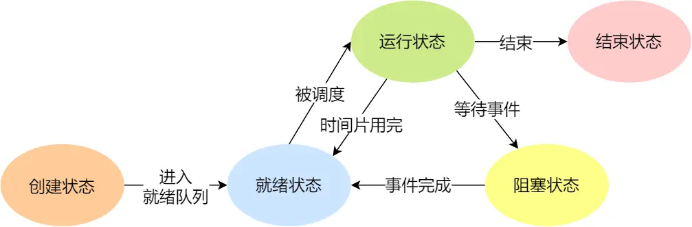

# WebServer项目笔记

## 1. 系统编程入门

### 程序流程

1. 预处理：生成预处理后的源代码(.i)，头文件展开、宏替换、删除注释。命令：-E
2. 编译：生成汇编代码(.s)。命令：-S
3. 汇编：生成目标代码(.o)。命令：-c
4. 链接：生成可执行程序(.exe .out)，将目标代码、库代码等链接在一起。命令：-o

### GCC选项参数

1. -E 预处理、-S 编译、-c 汇编、-o 链接
2. -I：指定include包含文件的搜索目录
3. -g：生成调试信息
4. -D：编译的时候，指定一个宏
5. -w：不生成任何警告信息
6. -Wall：生成所有警告信息
7. -On：n取0~3，表示编译器的优化级别，-O1为默认级别
8. -l：编译时指定使用的库名
9. -L：编译时搜索库的路径
10. -fPIC/fpic：生成与位置无关的代码
11. -shared：生成共享目标文件，通常用于建立动态库
12. -std：指定C方言，如-std=c99

### 库

静态库：在链接阶段被复制到程序中

动态库（共享库）：在程序运行时，由系统动态加载到内存

#### 静态库

**命名**

Linux：libxxx.a

Windows：libxxx.lib

// lib：前缀（固定），xxx：库名，.a .lib：后缀（固定）

**制作**

使用ar工具（archive）将.o文件打包

```shell
ar rcs libxxx.a xxx.o xxx.o
```

#### 动态库

**命名**

Linux：libxxx.so

Windows：libxxx.dll

**制作**

得到.o文件，得到与位置无关的代码

```shell
gcc -c -fpic xxx.c xxx.c
```

得到动态库

```shell
gcc -shared xxx.o xxx.o -o libxxx.so
```

**加载**

ldd命令：检查动态库的依赖关系

### makefile

**规则**

```shell
目标：依赖
	命令

# 自定义变量
变量名 = 变量值
var = hello.cpp
使用 $(var)

# 预定义变量
CC : C编译器名称
CXX : C++编译器名称
CXXFLAGS : C++编译选项
$@ : 目标
$< : 第一个依赖
$^ : 所有依赖
% : 通配符，匹配一个字符串
```

**使用**

```shell
1. touch Makefile
2. make
3. ./out
3. make clean
```

**示例**
include/
	head.h
src/
	head.cpp
main.cpp

```makefile
CXX = g++
CXXFLAGS = -c
TARGET = out
OBJ = main.o head.o

$(TARGET): $(OBJ)
	$(CXX) $(OBJ) -o $(TARGET)
	
main.o: main.cpp
	$(CXX) main.cpp $(CXXFLAGS) -I include
	
head.o: head.cpp
	$(CXX) head.cpp $(CXXFLAGS) -I include
	
.PHONY: clean
clean:
	# windows
	del *.o $(TARGET) -rf
	# Linux
	rm -f *.o $(TARGET)
```

### CMake

**使用**
```shell
1. touch CMakeLists.txt
2. mkdir build
3. cd build
4. cmake ..
5. make
6. ./out
7. rm -rf build
# Windows下默认使用MSVC编译，可指定MinGW编译器 cmake -G 'MinGW Makefiles'
```

**CMakeLists.txt**

```cmake
cmake_minimum_required(VERSION 3.10)

project(out)

include_directories(include)

add_executable(out main.cpp head.cpp)
```

### I/O

#### 文件指针

FILE* fp fopen()

fp为结构体指针，包含三部分：文件描述符（int fd）、文件读写指针、I/O缓冲区（内存地址）

#### I/O函数

```cpp
/* 打开文件
pathname: 文件路径
flags: 操作权限设置
	必选: O_RDONLY（只读）、O_WRONLY（只写）、O_RDWR（读写）
	可选: O_CREAT（创建）
return: 
	成功: 文件描述符fd
	失败: -1 */
int open(const char* pathname, int flags);

/* 创建文件
mode: 八进制数，文件权限 */
int open(const char* pathname, int flags, mode_t mode)

/* 关闭文件
fd: 文件描述符
return:
	0: 成功
	-1: 失败 */
int close(int fd);

/* 输出错误
s: 用户描述。
输出内容 s: 错误信息
void perror(const char* s);

/* 读文件
buf: 读取数据后存放的缓冲区，数组地址（传出参数）
count: buf的大小
return: 
	>0: 读取到的字节数
	=0: 表示文件已读取完
	<0: 失败 */
ssize_t read(int fd, void* buf, size_t count);

/* 写文件
buf: 写入数据的缓冲区
count：写入数据的实际大小
return:
	成功：写入的字节数
	失败：-1 */
ssize_t write(int fd, const void* buf, size_t count);

/* 设置文件指针
offset：偏移量
whence：
	SEEK_SET：设置文件指针的偏移量 = offset
	SEEK_CUR：设置文件指针的偏移量 = 当前位置 + offset
	SEEK_END：设置文件指针的偏移量 = 文件大小 + offset
return：文件指针的位置 */
off_t lseek(int fd, off_t offset, int whence);

/* 文件状态信息
pathname：文件路径
statbuf：传出参数，用于保存文件状态信息
return：
	成功：0
	失败：-1 */
int stat(const char* pathname, struct stat* statbuf);
int lstat(const char* pathname, struct stat* statbuf);
```

#### 文件属性函数

```cpp
/* 判断文件是否有某个权限 / 判断文件是否存在
mode：权限
	R_OK：是否有读权限
	W_OK：是否有写权限
	X_OK：是否有执行权限
	F_OK：是否存在
return：
	成功：0
	失败：-1 */
int access(const char* pathname, int mode);

/* 修改文件权限
mode：修改的文件权限，八进制数
return：
	成功：0
	失败：-1 */
int chmod(const char* filename, int mode);

/* 修改文件所有者、所在组 */
int chown(const char* path, uid_t owner, gid_t group);

/* 修改文件大小
length：指定的文件大小
return：
	成功：0
	失败：-1 */
int truncate(const char* path, off_t length);
```

#### 目录函数

```cpp
/* 创建目录
pathname：目录地址
mode：权限，八进制数
return：
	成功：0
	失败：-1 */
int mkdir(const char* pathname, mode_t mode);

/* 删除目录
return：
	成功：0
	失败：-1 */
int rmdir(const char* pathname);

/* 重命名目录
oldpath：原目录名
newpath：新目录名
return：
	成功：0
	失败：-1 */
int rename(const char* oldpath, const char* newpath);

/* 更改当前进程的目录
path：需要更改的目录地址
return：
	成功：0
	失败：-1 */
int chdir(const char* path);

/* 获取当前路径
buf：传出参数，存放目录的缓冲区
size：buf的大小
return：buf */
char* getcwd(char* buf, size_t size);

/* 打开目录
name：目录名
return：
	成功：返回目录流，DIR* 类型
	失败：NULL */
DIR* opendir(const char* name);

/* 读取目录
dirp：opendir的返回值
return：
	读取到的文件信息，struct dirent类型
	读取到末尾 / 失败：NULL */
struct dirent* readdir(DIR* dirp);

/* 关闭目录
dirp：opendir的返回值
return：
	成功：0
	失败：-1 */
int closedir(DIR* dirp);
```

#### 文件描述符函数

```cpp
/* 创建文件描述符，指向oldfd
return：新的文件描述符 */
int dup(int oldfd);

/* 重定向newfd，关闭newfd，指向oldfd
return: newfd */
int dup2(int oldfd, int newfd);

/* 操作文件描述符
cmd：
	F_DUPFD: 复制文件描述符，返回新的文件描述符
	F_GETFL：获取文件状态 flag
	F_SETFL：设置文件状态
		必选项：O_RDONLY、O_WRONLY、O_RDWR
		可选项：O_APPEND（追加数据）、NONBLOCK（非阻塞）*/
int fcntl(int fd, int cmd, ...);
```

#### 其他函数

```cpp
/* 将内存块的前 n 个字节清零
- s 内存块地址
- n 清零的字节数 */
void bzero(void* s, int n);

/* 对内存块进行填充
- str 内存块地址
- c 填充的值
- n 填充的个数
- return 内存块地址 str
memset 赋值时是按字节赋值
若 str 为 int 型，c 只能为 0 或 -1  */
void* memset(void* str, int c, size_t n);

/* 内存拷贝：将 src 的 前 n 个字节拷贝到 dest
- dest 目的内存
- src 源内存
- n 拷贝的字节数
- return dest */
void* memcpy(void* dest, void* src, size_t n);

// 若条件 expression 返回错误，终止进程
void assert(int expression);
```

### Shell命令

```shell
1. cd
2. ls -a / -l
2. mkdir
3. touch
4. pwd
5. kill
6. chmod
7. rm -f Filename
8. rm -rf Dirname
9. zip -r Filename.zip Dirname
10. unzip Filename.zip
11. cp -i Filename Dirroot
```

## 2. 多进程

### 进程

进程是正在运行的程序的实例，是资源分配的基本单元，是执行的基本单元

- 并行：多条指令同时执行
- 并发：同一时刻只有一条指令执行，多条指令轮换执行，在宏观上达到并行的效果

### PCB进程控制块

1. 进程id
2. 进程状态：阻塞、就绪、运行、挂起
3. 进程上下文切换需要保存和恢复的CPU寄存器
4. 虚拟地址空间
5. 控制终端
6. 工作目录
7. umask掩码
8. 文件描述符表
9. 信号
10. 用户id、组id
11. 会话、进程组

### 进程状态

#### 三态模型


运行态：正在占有CPU
就绪态：具备运行条件，进程已获得除CPU以外的资源
阻塞态：不具备运行条件，正在等待某个事件的完成

#### 五态模型



新建态：进程被创建，未进入就绪队列
终止态：进程运行结束或出错

#### 七态模型


挂起态：进程没有实际占用物理内存空间

阻塞挂起状态：进程在外存（硬盘）并等待某个事件的出现；
就绪挂起状态：进程在外存（硬盘），但只要进入内存，即刻立刻运行；

进程挂起的原因：
- 用户主动挂起 ctrl+Z
- 父进程需要
- 操作系统需要
- 负荷调节需要

### 进程命令

```shell
# 查看进程的快照
ps aux / ajx

# 动态显示系统资源情况
top

# 杀死进程
kill [-signal] pid

kill -1 # 列出所有信号
kill -SIGKILL pid
kill -9 pid # 强制杀死进程
killall name
```

### PID

进程号 PID，类型为 pid_t（整型）

任何进程（init进程除外）都由父进程创建，对应父进程号 PPID

进程组是多个进程的集合，进程组可以接收同一终端的信号，有一个进程组号 PGID，默认当前的进程号为当前的进程组号

```cpp
// 获取进程id
pid_t getpid();

// 获取父进程id
pid_t getppid()；

// 获取进程组id
pid_t getpgid(pid_t pid)；
```

### 进程创建

```cpp
// 创建子进程
pid_t fork(void);
// 成功：父进程返回子进程PID，子进程返回0
// 失败：父进程返回-1(进程数达到上限 / 系统内存不足)
```

fork() 后，会copy父进程的地址空间作为子进程的地址空间，两者的用户态相同，内核态相同（PID不同）

Linux 的 fork() 使用写时拷贝（copy-on-write）技术：创建时，并不会复制整个地址空间，而是让父子进程共享同一个地址空间，以只读的方式进行共享，只有需要写入时才会进行复制。

父子进程共享文件：
fork() 后，父子进程具有相同的文件描述符表，引用计数增加，共享文件偏移指针

**父子进程的关系**

- 不同：
	- fork() 返回值不同
	- PCB 中的 PID、PPID、信号集

- 相同：
	**子进程被创建，还未进行写操作时**
	- 用户区的数据
	- 文件描述符表

**exec函数族**

exec函数：在调用进程内部执行一个可执行文件
一般在子进程中使用 exec 函数，将子进程的用户区替换为调用程序的用户区

exec() 函数调用成功后，不会返回。因为调用进程的用户区已被新的内容所取代。调用失败则返回-1.

```cpp
execl(const char* path, const char* arg, ...);
/* path: 可执行文件的路径
arg：可执行文件的参数列表
	第一个参数默认为程序的名称（无作用）
	其余为可执行程序所需的参数
	参数以 NULL 结尾
return：失败返回 -1，成功无返回值
```

### 进程退出

```cpp
// 标准C库函数
void exit(int status);

// Liunx系统函数
void _exit(int status);
```

#### 孤儿进程

父进程运行结束，子进程还在运行，则子进程为**孤儿进程**

由于子进程结束时，父进程需回收资源。因此，当出现孤儿进程时，内核会将孤儿进程的父进程设置为 init 进程（PID = 1），而 init 进程会对其子进程循环地调用 `wait()`，进行资源回收。因此孤儿进程不会产生危害

#### 僵尸进程

每个进程结束后，会释放用户区的数据，内核区中的 PCB 则需要父进程回收释放

进程结束后，父进程尚未回收资源，子进程的残留资源存放于内核中，则子进程为**僵尸进程**

僵尸进程不能被 kill -9 杀死

如果父进程未调用 wait()、waitpid()，则子进程的资源不会释放，其进程号被占用。由于系统的进程号有限，若存在大量的僵尸进程，会导致没有可用的进程号无法创建进程的情况发生。

### 进程回收

进程退出时，内核会回收资源，但 PCB 信息仍需父进程进行回收

父进程通过调用 wait()、waitpid() 得到子进程的退出状态并清理

```cpp
// wstatus: 传出参数，用于写入子进程退出时的状态信息
// return: 成功返回子进程的pid，失败返回-1
pid_t wait(int* wstatus);

/* pid:
 	> 0: 子进程的pid
 	= 0: 回收当前进程组的所有子进程
 	= -1: 回收所有的子进程，相当于wait()
	< -1: 某个进程组的组id的绝对值，回收该进程组的子进程
options: 0（阻塞）、WNOHANG（非阻塞）
return:
 	> 0: 成功，子进程的pid
 	= 0: 非阻塞情况下，子进程未回收
 	< 0: 失败 */
pid_t waitpid(pid_t pid, int* wstatus, int options);

```

- wait：默认阻塞，直到子进程退出或收到信号
- waitpid：默认阻塞，可设置非阻塞，可指定子进程的pid
- 两者一次只能清理一个子进程

### 进程间通信（IPC）

**目的**

* 数据传输
* 通知事件：进程终止通知父进程
* 资源共享：内核需提供同步、互斥机制
* 进程控制：Debug进程

**方式**

同一主机
* 匿名管道
* 命名管道
* 信号
* 消息队列
* 共享内存
* 内存映射
* 信号量

不同主机
* Socket

#### 匿名管道

管道本质是内核在内存中的维护的缓冲区，管道具有文件的属性：读、写，但匿名管道没有文件实体，可以按照操作文件的方式来操作管道。

管道中的数据为子节流，数据的传输方向为单向，一端写入一端读取。

匿名管道只能在具有公共祖先的进程间使用（父子进程、兄弟进程）。

管道的内部数据结构为循环队列

管道默认阻塞：若管道内无数据，`read()`阻塞；若管道已满，`write()`阻塞。可通过 `fcntl()` 函数将管道设置为非阻塞

```cpp
/* 创建管道
pipefd: 传出参数，pipefd[0]读端，pipefd[1]写端
return：成功返回0，失败返回-1 */
int pipe(int pipefd[2]);
```

**管道读写特点**

读管道：
- 管道中有数据，read返回实际读到的字节数。
- 管道中无数据：
	- 写端被全部关闭，read返回0（相当于读到文件的末尾）
	- 写端没有完全关闭，read阻塞等待

写管道：
- 管道读端全部被关闭，进程异常终止（进程收到SIGPIPE信号）
- 管道读端没有全部关闭：
	- 管道已满，write阻塞
	- 管道没有满，write将数据写入，并返回实际写入的字节数

#### 有名管道（FIFO）

不同于匿名管道，有名管道具有文件实体，以 FIFO 文件形式存放文件系统。即使与 FIFO 的创建进程不具有亲缘关系的进程也可以通过访问路径，进行进程间的通信。

**特点**
* FIFO 是文件系统中的一个特殊文件，没有文件内容，其内容保存在内存中
* 当进程间通信结束，FIFO 文件仍然保存在文件系统
* FIFO 有名字，不相关的进程可以进行通信

**FIFO 的创建**
```cpp
// 命令
mkfifo 名字

// 函数
/* mode：文件权限，八进制数
return：成功返回0，失败返回-1 */
int mkfifo(const char* pathname, mode_t mode);
```

FIFO 严格遵循先进先出原则，因此不支持 `lseek()` 文件定位操作

**有名管道的注意事项**
1. 一个为只读而打开一个管道的进程会阻塞，直到另外一个进程为只写打开管道
2. 一个为只写而打开一个管道的进程会阻塞，直到另外一个进程为只读打开管道

读管道：
- 管道中有数据，read返回实际读到的字节数
- 管道中无数据：
	- 管道写端被全部关闭，read返回0，（相当于读到文件末尾）
	- 写端没有全部被关闭，read阻塞等待

写管道：
- 管道读端被全部关闭，进行异常终止（收到一个SIGPIPE信号）
- 管道读端没有全部关闭：
	- 管道已经满了，write会阻塞
	- 管道没有满，write将数据写入，并返回实际写入的字节数。

#### 内存映射

内存映射：将磁盘文件的数据映射到内存，用户通过修改内存就能修改磁盘文件

```cpp
/* 内存映射：将文件的数据映射到内存中
addr：映射内存的首地址，当 addr 为 NULL 时，由内核制定
lenght：映射数据的长度，不能为0，建议使用文件的长度
prot：申请的内存映射区的操作权限
	PROT_EXEC：可执行
	PROT_READ：可读
	PROT_WRITE：可写
	PROT_NONE：没有权限
flags：同步状态的设置
	MAP_SHARED：映射区的数据会自动和文件同步
	MAP_PRIVATE：不同步，映射区的数据改变时，原文件不更改，会创建一个新文件
fd：映射文件的文件描述符
offset：偏移量，必须为4k的整数倍 
return：
	成功：映射内存的首地址
	失败：MAP_FAILED (void*) -1 */
void* mmap(void* addr, size_t lenght, int prot, int flags, int fd, off_t offset);

/* 释放内存映射
addr：释放内存的首地址
lenght：释放内存映射的大小 */
int munmap(void* addr, size_t lenght);
```

使用内存映射实现进程间通信：

1.有关系的进程（父子进程）
- 还没有子进程的时候
	- 通过唯一的父进程，先创建内存映射区
- 有了内存映射区以后，创建子进程
- 父子进程共享创建的内存映射区

2.没有关系的进程间通信
- 准备一个大小不是0的磁盘文件
- 进程1 通过磁盘文件创建内存映射区
	- 得到一个操作这块内存的指针
- 进程2 通过磁盘文件创建内存映射区
	- 得到一个操作这块内存的指针
- 使用内存映射区通信

注意：内存映射区通信，是**非阻塞**。

**匿名映射** ：不需要文件实体来进行内存映射

mmap() 的参数 flags 设置为 MAP_ANONYMOUS，则 mmap() 忽略 fd，一般将 fd 设置为 -1

#### 信号

信号是事件发生时对进程的通知机制（软件中断），是一种异步通信的方式。

```cpp
// 查看系统信号列表，前31为常规信号，其余为实时信号
kill -l
```

**系统信号列表**

- 2号 SIGINT ctrl + C 触发的信号，终止进程
- 3号 SIGQUIT ctrl + \ 触发的信号，终止进程
- 9号 SIGKILL 无条件终止进程
- 11号 SIGSEGV 无效内存访问（段错误）
- 13号 SIGPIPE 向没有读端的管道写数据
- 17号 SIGCHILD 子进程结束，父进程会收到该信号
- 18号 SIGCONT 若进程停止，则继续运行
- 19号 SIGSTOP 停止进程
- **SIGKILL、SIGSTOP 不能被捕捉、阻塞、忽略**

**信号的默认处理动作**
- Term 终止进程
- Ign 忽略信号
- Core 终止进程，并生成Core文件
- Stop 暂停当前进程
- Cont 继续执行当前被暂停的进程

**信号发送函数**

```cpp
/* 给进程/进程组发送信号
pid：
	>0: 进程的pid
	0: 当前进程组
	-1: 每一个有权限接受信号的进程
	<-1: 给pgid = - pid 的进程组
sig：信号的宏值
return：成功返回0，失败返回非0 */
int kill(pid_t pid, int sig);

/* 给当前进程发送信号
return：成功返回0，失败返回非0 */
int raise(int sig);

// 发送SIGABRD给当前进程，杀死当前进程
void abort(void);

/* 设置定时器。函数调用，开始倒计时，当倒计时为0的时候，函数会给当前的进程发送一个信号：SIGALARM
seconds: 倒计时的时长，单位：秒。如果参数为0，定时器无效（不进行倒计时，不发信号)。取消一个定时器，通过alarm(0)
return：
	之前没有定时器，返回0
	之前有定时器，返回之前的定时器剩余的时间
SIGALARM ：默认终止当前的进程，每一个进程都有且只有唯一的一个定时器。 */
unsigned int alarm(unsigned int seconds);

/* 设置定时器。精度微妙us，可实现周期性定时
which : 定时器以什么时间计时
	ITIMER_REAL: 真实时间，时间到达，发送 SIGALRM（常用）
	ITIMER_VIRTUAL: 用户时间，时间到达，发送 SIGVTALRM
	ITIMER_PROF: 以该进程在用户态和内核态下所消耗的时间来计算，时间到达，发送 SIGPROF
new_value: 设置定时器时间的属性
struct itimerval { // 定时器的结构体
    struct timeval it_interval; // 每个阶段的时间，间隔时间
    struct timeval it_value; // 延迟多长时间执行定时器
};
struct timeval { // 时间的结构体
	time_t tv_sec; // 秒数     
	suseconds_t tv_usec; // 微秒    
};
old_value ：记录上一次的定时的时间参数，一般不使用，指定NULL
return：成功返回0，失败 -1 */
int setitimer(int which, const struct itimerval *new_value, struct itimerval *old_value)；
```

**信号捕捉函数**
```cpp
/*
设置信号的捕捉行为
- signum: 捕捉的信号
- handler: 信号处理标志
	- SIG_IGN：忽略信号
	- SIG_DFL：使用信号默认的行为
	- 回调函数：这个函数是内核调用，程序员只负责写，捕捉到信号后如何去处理信号。
- 返回值：
	- 成功，返回上一次注册的信号处理函数的地址。第一次调用返回NULL
	- 失败，返回SIG_ERR，设置错误号

回调函数：
- 需要程序员实现，提前准备好的，函数的类型根据实际需求，看函数指针的定义
- 不是程序员调用，而是当信号产生，由内核调用
- 函数指针是实现回调的手段，函数实现之后，将函数名放到函数指针的位置就可以了。

SIGKILL SIGSTOP不能被捕捉，不能被忽略。*/
sighandler_t signal(int signum, sighandler_t handler);

/* 检查或者改变信号的处理。信号捕捉
- signum：需要捕捉的信号
- act：捕捉到信号之后的处理动作
- oldact：上一次对信号捕捉相关的设置，一般不使用，传递NULL
- return：成功 0，失败 -1

struct sigaction { 
	// 函数指针，指向的函数就是信号捕捉到之后的处理函数
	void (*sa_handler)(int);

	// 不常用
	void (*sa_sigaction)(int, siginfo_t *, void *);

	// 临时阻塞信号集，在信号捕捉函数执行过程中，临时阻塞某些信号。
	sigset_t sa_mask;
	
	// 使用哪一个信号处理对捕捉到的信号进行处理，0表示使用sa_handler, SA_SIGINFO表示使用sa_sigaction
	int sa_flags;

	// 已废弃
	void (*sa_restorer)(void);
}; */
int sigaction(int signum, const struct sigaction *act, struct sigaction *oldact);
```

**信号集**

多个信号可使用信号集的数据结构来表示，sigset_t类型

在PCB中有两个信号集：阻塞信号集、未决信号集，操作系统不允许用户直接对这两个信号集进行修改，需要自定义信号集，借助信号集操作函数来进行修改

**信号集函数**

```cpp
// 清空信号集（将信号集所有标志设置为0），都为非阻塞
int sigemptyset(sigset_t *set);

// 将信号集所有标志设置为1，都为阻塞
int sigfillset(sigset_t *set);

//设置信号集中的某一个信号对应的标志位为1，表示阻塞这个信号
int sigaddset(sigset_t *set, int signum);

// 设置信号集中的某一个信号对应的标志位为0，表示不阻塞这个信号
int sigdelset(sigset_t *set, int signum);

// 判断某个信号是否阻塞
int sigismember(const sigset_t *set, int signum);

/* 将自定义信号集中的数据设置到内核中（设置阻塞，解除阻塞，替换）
- how : 如何对内核阻塞信号集进行处理
	- SIG_BLOCK: 将用户设置的阻塞信号集添加到内核中，内核中原来的数据不变 mask |= set 
	- SIG_UNBLOCK: 根据用户设置的数据，对内核中的数据进行解除阻塞 mask &= ~set
	- SIG_SETMASK:覆盖内核中原来的值
set ：已经初始化好的用户自定义的信号集
oldset : 保存设置之前的内核中的阻塞信号集的状态，可以是 NULL
- return: 成功返回0，失败返回-1 */
int sigprocmask(int how, const sigset_t *set, sigset_t *oldset);

/* 获取内核中的未决信号集
- set,传出参数，保存的是内核中的未决信号集中的信息 */
int sigpending(sigset_t *set);
```

**SIGCHLD信号**

产生条件
- 子进程终止时
- 子进程接收到SIGSTOP信号停止时
- 子进程处于停止态，接收到SIGCONT后唤醒时

满足上述条件时，子进程会发送SIGCHLD信号给父进程，父进程默认忽略该信号

使用 SIGCHLD 信号，可以解决僵尸进程问题

#### 共享内存

共享内存：允许多个进程共享物理内存的同一块区域。共享内存段位于进程用户空间，因此 IPC 无需内核介入。

其他 IPC 机制需要发送进程将数据从用户态缓冲区复制到内核态缓冲区，接收进程将数据从内核态缓冲区复制到用户态缓冲区，共享内存由于不需要内核介入，是速度最快的 IPC。

**步骤**

- 创建一个新共享内存段 / 获取得一个既有共享内存段
- 关联共享内存段
- 分离共享内存段
- 删除共享内存段

**函数**

```cpp
/* 创建一个新共享内存段 / 获取一个已有的共享内存段
- key IPC标识，16进制，非0值
- size 共享内存大小
- shmflg 属性设置
	- 访问属性
	- 附加属性
		- IPC_CREATE 创建共享内存
		- IPC_EXCL 判断共享内存是否存在
- return
	- 成功 共享内存的引用ID
	- 失败 -1 */
int shmget(key_t key, size_t size, int shmflg);

/* 将共享内存和当前进程进行关联
- shmid 共享内存ID，由shmget返回值指定
- shmaddr 共享内存的起始地址，由内核制定，应为 NULL
- shmflg 对共享内存的操作
	- 读 SHM_RDONLY
	- 读写 0
- return
	- 成功 共享内存的起始地址
	- 失败 (void*) -1 */
void *shmat(int shmid, const void *shmaddr, int shmflg); 

/* 分离共享内存与进程的关联
- shmaddr 共享内存的起始地址
- return 成功0，失败-1 */
int shmdt(const void *shmaddr);

/* 设置共享内存
- shmid 共享内存ID
- cmd 操作
	- IPC_STAT 获取共享内存的状态
	- IPC_SET 设置共享内存的状态
	- IPC_RMID 标记共享内存被销毁
- buf 设置或者获取的共享内存的属性信息
	- IPC_STAT buf存储数据
	- IPC_SET buf中需要初始化数据，设置到内核中
	- IPC_RMID 没有用，NULL
- return 成功0 失败-1 */
int shmctl(int shmid, int cmd, struct shmid_ds *buf);

/* 由指定的路径名、int值，生成一个共享内存的key
- pathname 路径
- proj_id 一般为‘a'
- return
	- 成功 key
	- 失败 -1 */
key_t ftok(const char *pathname, int proj_id);
```

问题1：操作系统如何知道一块共享内存被多少个进程关联？
    - 共享内存维护了一个结构体struct shmid_ds 这个结构体中有一个成员 shm_nattch
    - shm_nattach 记录了关联的进程个数

问题2：可不可以对共享内存进行多次删除 shmctl
    - 可以的
    - 因为shmctl 标记删除共享内存，不是直接删除
    - 什么时候真正删除呢?
        当和共享内存关联的进程数为0的时候，就真正被删除
    - 当共享内存的key为0的时候，表示共享内存被标记删除了
        如果一个进程和共享内存取消关联，那么这个进程就不能继续操作这个共享内存。也不能进行关联。

**共享内存和内存映射**
1.共享内存可以直接创建，内存映射需要磁盘文件（匿名映射除外）
2.共享内存速度更高
3.内存
	- 共享内存：所有的进程操作的是同一块内存。
	- 内存映射：每个进程在自己的虚拟地址空间中有一个独立的内存。
4.数据安全
	- 进程突然退出
		- 共享内存还存在
		- 内存映射区消失
	- 运行进程的电脑死机，宕机了
		数据存在在共享内存中，没有了
		内存映射区的数据 ，由于磁盘文件中的数据还在，所以内存映射区的数据还存在。
5.生命周期
	- 内存映射区：进程退出，内存映射区销毁
	- 共享内存：进程退出，共享内存还在，标记删除（所有的关联的进程数为0），或者关机。如果一个进程退出，会自动和共享内存进行取消关联。

### 守护进程

**控制终端**

用户通过终端登录系统后得到一个 shell 进程，这个终端成为 shell 进程的控制终端(Controlling Terminal)。
进程中，控制终端是保存在 PCB 中的信息，而 fork() 会复制 PCB 中的信息，因此由 shell 进程启动的其它进程的控制终端也是这个终端。
默认情况下，每个进程的标准输入、标准输出和标准错误输出都指向控制终端。

**进程组 会话**

进程组：一组相关进程的集合
进程组首进程：创建进程组的进程，其进程 PID 为该进程组的 PGID，新进程会继承其父进程所属的进程组 PGID。
进程组的生命周期：开始于首进程创建的时刻，结束于最后一个进程退出进程组的时刻

会话：一组相关进程组的集合
会话首进程：创建会话的进程，其进程 PID 会成为会话 SID，新进程会继承其父进程的会话 SID。
会话中的所有进程共享单个控制终端，控制终端会在会话首进程首次打开一个终端设备时被建立，一个终端最多可能会成为一个会话的控制终端。

**函数**

```cpp
pid_t getpgrp(void); // 获取当前进程组
pid_t getpgid(pid_t pid);
int setpgid(pid_t pid, pid_t pgid);
pid_t getsid(pid_t pid);
pid_t setsid(void);
```

**守护进程**

守护进程（Daemon 进程）：Linux中的后台服务进程，独立于控制终端并且周期性地执行某种任务或等待处理某些发生的事件

守护进程特点：
- 生命周期很长，守护进程会在系统启动的时候被创建并一直运行直至系统被关闭
- 在后台运行并且不拥有控制终端。没有控制终端确保了内核永远不会为守护进程自动生成任何控制信号以及终端相关的信号

**守护进程创建步骤**
1. 执行`fork()`，父进程退出，子进程继续执行
2. 子进程调用 setsid() 开启一个新会话。
3. 清除进程的 umask 以确保当守护进程创建文件和目录时拥有所需的权限。 
4. 修改进程的当前工作目录，通常会改为根目录(/)。 
5. 关闭守护进程从其父进程继承而来的所有打开着的文件描述符。 
6. 在关闭了文件描述符0、1、2之后，守护进程通常会打开/dev/null 并使用dup2() 使所有这些描述符指向这个设备。
7. 核心业务逻辑

## 3. 多线程

### 线程

进程是 CPU 资源分配的最小单位，线程是操作系统调度执行的最小单位
一个进程内可以包含多个线程，不同线程间独立运行，且共享同一份全局内存区域，包括 初始化数据段(.data)、未初始化数据段(.bss)、堆内存段。

**线程间的共享资源**
- 进程 ID、父进程 ID
- 进程组 ID、会话 ID
- 用户 ID、用户组 ID
- 文件描述符表
- 信号处置
- 文件系统相关信息：文件权限掩码(umask)、当前工作目录
- 虚拟地址空间（除 栈空间）

**非共享资源**
- 线程 ID
- 信号掩码
- 线程特有数据
- error 变量
- 实时调度策略的优先级
- 栈空间、本地变量、函数的调用链接信息

### 线程操作函数

main 函数所在的线程为 主线程，其余创建的线程为子线程
线程 ID 为 pthread_t 类型

```cpp
/* 线程创建
- thread 传出参数，子线程 ID
- attr 子线程属性，默认为 NULL
- start_routine 函数指针，子线程的工作函数（返回值和参数均为 void* 类型）
- arg 工作函数的参数
- return 成功返回0，失败返回错误号 */
int pthread_create(pthread_t *thread, const pthread_attr_t *attr, void *(*start_routine) (void *), void *arg);

// 获取当前线程的 ID
pthread_t pthread_self(void);

/* 比较两个线程的 ID 是否相等
- return 相等返回非0值，不同返回0 */
int pthread_equal(pthread_t t1, pthread_t t2);

/* 线程退出，终止该线程
- retval 传出参数，线程退出时的返回值，可用于 pthread_john 的参数，默认为 NULL */
void pthread_exit(void *retval);

/* 线程连接，回收已终止线程的资源，阻塞函数，调用一次只能回收一个子线程
- thread 回收线程 ID
- retval 二级指针，线程退出时的返回值
- return 成功0，失败非0 */
int pthread_join(pthread_t thread, void **retval);

/* 线程分离，被分离的线程在终止时，不需要进行资源回收，会自动释放资源给系统
	- 不能对线程进行多次分离
	- 不能通过 pthread_join 回收已分离的线程
- thread 需要线程分离的 ID
- return 成功0，失败返回错误号 */
int pthread_detach(pthread_t thread);

/* 取消某个线程，即当该线程执行到某个取消点时，终止
取消点：系统规定好的一些系统调用，可以粗略的理解为从用户区到内核区的切换
- return 成功0，失败非0 */
int pthread_cancel(pthread_t thread);
```

### 线程属性

类型：pthread_attr_t

```cpp
// 初始化线程属性
int pthread_attr_init(pthread_attr_t *attr);

// 释放线程属性
int pthread_attr_destroy(pthread_attr_t *attr);

// 获取线程分离的状态属性
int pthread_attr_getdetachstate(const pthread_attr_t *attr, int *detachstate);

// 设置线程分离的状态属性
int pthread_attr_setdetachstate(pthread_attr_t *attr, int detachstate);
```

### 线程同步

临界区：访问共享资源的代码段，应保证多个线程不会同时访问共享资源

线程同步：同一时刻，只能有一个线程对共享资源进行操作，当其他线程对该共享资源操作时，应处于等待状态。

#### 互斥量（互斥锁）

通过互斥量的加锁、解锁状态，来保证对共享资源的原子访问

当线程锁定互斥量时，即成为该互斥量的所有者，只有所有者才能给互斥量解锁。
不能对已加锁的互斥量再次加锁，可能会阻塞该线程或报错。

访问共享资源的步骤：
1. 针对共享资源进行加锁
2. 访问共享资源
3. 解锁

互斥量类型 `pthread_mutex_t`

**函数**

```cpp
/* 初始化互斥量
- mutex 互斥量
- attr 互斥量属性，默认为 NULL
- restrict C语言修饰符，被修饰的指针不能由另外一个指针进行操作 */
int pthread_mutex_init(pthread_mutex_t *restrict mutex, const pthread_mutexattr_t *restrict attr);

// 释放互斥量
int pthread_mutex_destroy(pthread_mutex_t *mutex);

// 加锁（阻塞）
int pthread_mutex_lock(pthread_mutex_t *mutex);

// 尝试加锁（非阻塞）
int pthread_mutex_trylock(pthread_mutex_t *mutex);

// 解锁
int pthread_mutex_unlock(pthread_mutex_t *mutex);
```

#### 死锁

死锁：多个线程在执行过程中，因争夺共享资源而造成的一个互相等待的现象

**产生原因**
- 忘记解锁
- 重复加锁
- 多线程多锁，抢占锁资源

**必要条件**
- 互斥
- 请求与保持
- 不可剥夺
- 循环等待

#### 读写锁

读共享锁：允许多个线程读，不允许写
写独占锁：只允许一个线程写，不允许读
优先级：写 > 读

读写锁类型`pthread_rwlock_t`

**函数**

```cpp
// 初始化读写锁
int pthread_rwlock_init(pthread_rwlock_t *restrict rwlock, const pthread_rwlockattr_t *restrict attr);

// 释放读写锁
int pthread_rwlock_destroy(pthread_rwlock_t *rwlock);

// 加读锁
int pthread_rwlock_rdlock(pthread_rwlock_t *rwlock);

// 尝试加读锁
int pthread_rwlock_tryrdlock(pthread_rwlock_t *rwlock);

// 加写锁
int pthread_rwlock_wrlock(pthread_rwlock_t *rwlock);

// 尝试加写锁
int pthread_rwlock_trywrlock(pthread_rwlock_t *rwlock);

// 解锁
int pthread_rwlock_unlock(pthread_rwlock_t *rwlock);
```

#### 生产者消费者模型

#### 条件变量

条件变量类型`pthread_cond_t`

**函数**

```cpp
/* 初始化条件变量
- cond 条件变量
- attr 条件变量属性，默认为NULL */
int pthread_cond_init(pthread_cond_t *restrict cond, const pthread_condattr_t *restrict attr);

// 释放条件变量
int pthread_cond_destroy(pthread_cond_t *cond);

/* 等待，线程阻塞
- mutex 互斥锁
- 调用该函数后，先解锁，待满足条件后，再上锁 */
int pthread_cond_wait(pthread_cond_t *restrict cond, pthread_mutex_t *restrict mutex);

// 等待，可指定时间
int pthread_cond_timedwait(pthread_cond_t *restrict cond, pthread_mutex_t *restrict mutex, const struct timespec *restrict abstime);

// 唤醒一个或者多个等待的线程
int pthread_cond_signal(pthread_cond_t *cond);

// 唤醒所有的等待的线程
int pthread_cond_broadcast(pthread_cond_t *cond);
```

#### 信号量

信号量类型`sem_t`

**函数**

```cpp
/* 初始化信号量
- sem 信号量地址
- pshared 
	- 0 线程间
	- 非0 进程间
- value 信号量的初始值 */
int sem_init(sem_t *sem, int pshared, unsigned int value);

// 释放信号量
int sem_destroy(sem_t *sem);

// 信号量加锁，信号量-1；若信号量为0，则阻塞
int sem_wait(sem_t *sem);

// 信号量尝试加锁，非阻塞
int sem_trywait(sem_t *sem);

int sem_timedwait(sem_t *sem, const struct timespec *abs_timeout);

// 信号量解锁，信号量+1
int sem_post(sem_t *sem);

// 获得信号量的值
int sem_getvalue(sem_t *sem, int *sval);
```

## 4. 网络编程

### 网络基础

#### 端口

**常见端口号**
- 21 FTP 服务
- 22 SSH 服务
- 23 Telnet 服务
- 25 SMTP 服务
- 80 HTTP 服务
- 443 HTTPS 服务

## 5. WebServer

### 日志

